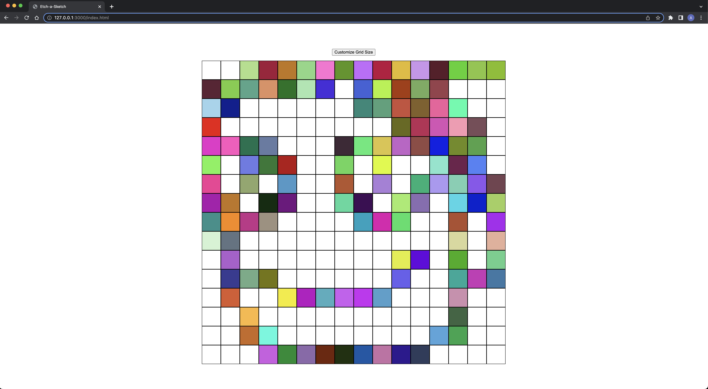
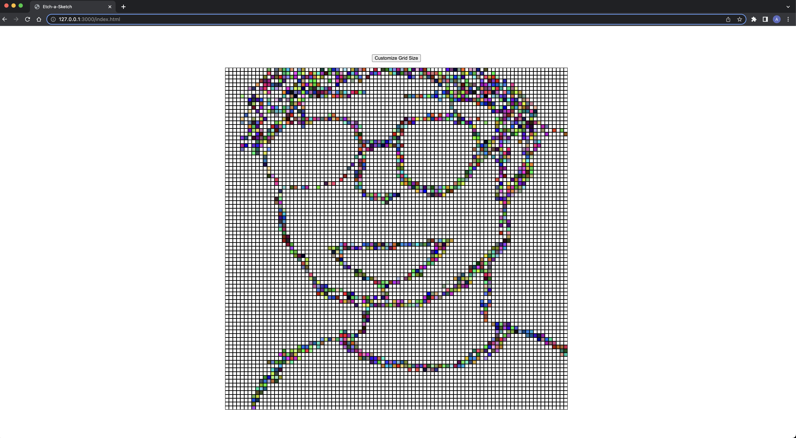

# etch-a-sketch

A simple Etch-a-Sketch application built using HTML, CSS, and JavaScript. This project allows you to draw colorful patterns on a grid by hovering over the squares.

## Demo

You can view a live demo of the project [here](https://anthonynguyent.github.io/etch-a-sketch/).

## Technologies Used
- HTML5
- CSS3
- Javascript (ES6)
- Visual Studio Code

## Features

- Draw colorful patterns on a grid.
- Customize the grid size according to your preference.
- Hover over the squares to create vibrant designs.
- Random RGB color generation for a dynamic experience.

## Getting Started

To get started with this project, simply clone the repository and open the `index.html` file in your web browser.

## Usage

Once you have the application open in your web browser, you can start drawing by moving your mouse over the grid squares. The color of each square changes randomly as you hover over them.

## Customizing Grid Size

You can customize the grid size to create larger or smaller canvases for drawing. Here's how to do it:

1. Click the "Customize Grid Size" button.
2. A prompt will appear asking you to enter a number between 1 and 100 for the grid's size.
3. Enter the desired size and click "OK."

Please note that the value entered should be an integer between 1 and 100.

## Screenshots

*Happy Face on Default Sized Grid (16x16)*

*Self Portrait on a Size Customized 90x90 Grid*

## License

This project is licensed under the [MIT License](LICENSE). You are free to use, modify, and distribute this code as you see fit.

---

Happy drawing! 🎨